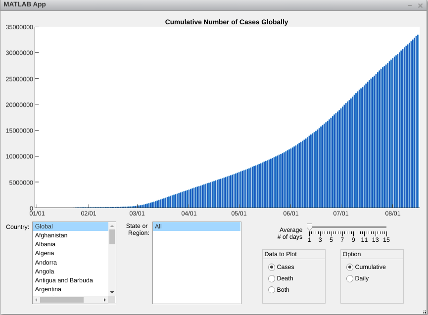
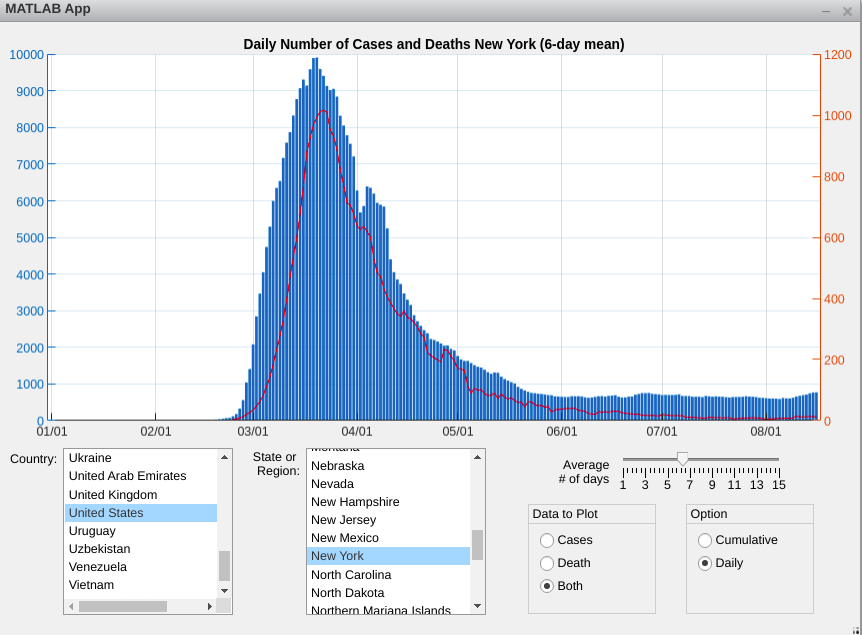

## Covid-19 Data Visualizer

Covid-19 Data Visualizer created using MATLAB online for the course "Mastering programming with MATLAB"
on Coursera. The data source is provided by John Hopkins University.

